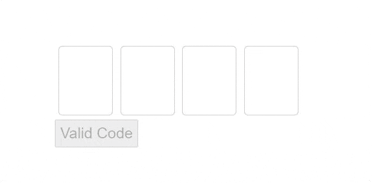

<h1 align="center">Ng Code Verification</h1>

[](https://travis-ci.org/JsDaddy/ngx-mask)

# NgCodeVerification

Angular component for code verification



### How to install

Install component with NPM

```bash
    $ npm install ng-code-verification
````

## Quickstart

Import **ng-code-verification** module in Angular app.

### With default mask config options

```typescript
import { NgCodeVerification } from 'ng-code-verification'

@NgModule({
  imports: [
    NgCodeVerification,
  ],
})
```

### Usage

```html
<ng-code-verification [codeTotal]="4" (codeComplete)="onComplete($event)"></ng-code-verification>
```

#### Arguments

| Argument           | Description        |
| -------------- | -------------- |
|codeTotal     | Number total of code verification     |
| codeComplete         | Function that will call after all the codes was completed        |

#### Output return
The codeComplete return an object with two keys:
- code (the code that was digited by user)
- valid (boolean -> check if all codes was digited)

### Help
if you need more help with this component talk to me <contato@sergiocardoso.dev>